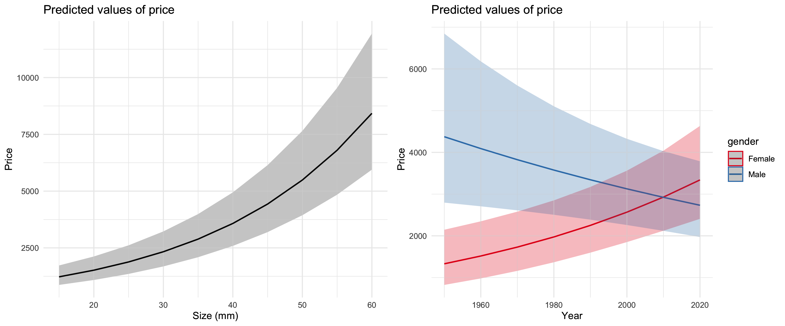

```{r, echo=FALSE, warning=FALSE, message = FALSE}
library(rvest)
library(stringr)
library(dplyr)
library(ggplot2)
library(jsonlite)
library(httr)
library(purrr)
library(sjPlot)
library(lme4)
library(gridExtra)
knitr::opts_chunk$set(echo=FALSE, warning=FALSE, message = FALSE, eval = FALSE)
```

## Introduction

This case study explores the factors associated with luxury watch pricing and evaluates whether luxury watch purchases could be considered an investment. Initially, I wanted to approach this question by treating luxury watches like a financial asset. I aimed to create a luxury watch index, and use its historical returns, correlation to the market and other metrics to evaluate watches as an investment. For several reasons, this appraoch was not viable. For one, luxury watches are far from homogenous, and there are huge variations in price from one watch to the next, so a single index would not be particularly informative. More importantly, financial indices require rich historical transaction data to calculate, something surprisingly elusive in this market. Using both eBay and Amazon APIs, I was unable to find more than a handful of relevant transactions. I believe this is because buyers of luxury watches usually purchase to keep for decades, not resell, and platforms such as eBay have connotations that may hurt the resale value of a watch. Instead, the most common platforms for exchange are likely jewelry stores or high-end exchanges. Accordingly, I shifted my approach and instead used data from one of these high-end luxury watch exchanges, ChroNEXT to determine which features are relevant in determine watch price. I then used this model to evaluate to what extent luxury watches appreciate or depreciate over time. I also created an RShiny app to share these data and results with the public.


```{r}
if(!file.exists("watches.rds")){
  numpages = 14
  storage = vector(mode = "list", length = numpages)
  
  url_base = "https://www.chronext.com/buy?filter.gender=f&page="
  
  parse_html = function(url){
    read_html(url) %>%
      html_nodes(".product-tile__model , .product-tile__price , .product-tile__brand , .overlay-link") %>%
      html_text() %>%
      unlist()
  }
  
  
  for(i in 1:numpages){
    url = paste0(url_base, i)
    storage[[i]] = parse_html(url)
  }
  
  
  parse_price = function(price){
    price %>% 
      str_remove_all("\ ") %>% 
      str_remove_all("\\\n")%>% 
      str_remove_all(",") %>%
      str_split("\\$") %>%
      .[[1]] %>%
      .[[2]] %>%
      as.numeric()
  }
  
  parse_raw = function(vect){
    len = length(vect) / 4
    size = rep(NA, len)
    material = rep(NA, len)
    condition = rep(NA, len)
    year = rep(NA, len)
    brand = rep(NA, len)
    title = rep(NA, len)
    price = rep(NA, len)
    for(i in 1:len){
      brand[i] = vect[(i-1)*4 + 2]
      title[i] = vect[(i-1)*4 + 3]
      price[i] = vect[(i-1)*4 + 4] %>% parse_price()
        
      chunk = vect[(i-1)*4 + 1] %>%
        str_remove_all("\ ")
      
      chunk = str_split(chunk, "\\\n")
  
      size[i] = chunk[[1]][2] %>% str_remove_all("mm") %>% as.numeric()
      material[i] = chunk[[1]][3]
      condition[i] = chunk[[1]][4]
      year[i] = chunk[[1]][5] %>% as.numeric()
    }
    return(data.frame(size, material, condition, year, brand, title, price))
  }
  
  
  watches_f = map_df(1:length(storage),function(i) {parse_raw(storage[[i]])})
  watches_f = na.omit(watches_f)
  watches_f = watches_f[which(watches_f$size != 250), ]
  
  # repeat for mens
  url_base_m = "https://www.chronext.com/buy?filter.gender=m&page="
  storage_m = vector(mode = "list", length = numpages)
  
  for(i in 1:numpages){
    url = paste0(url_base_m, i)
    storage_m[[i]] = parse_html(url)
  }
  
  watches_m = map_df(1:length(storage_m),function(i) {parse_raw(storage_m[[i]])})
  watches_m = na.omit(watches_m)
  watches_m = watches_m[which(watches_m$size != 250), ]
  
  
  #combine
  watches_f$gender = "female"
  watches_m$gender = "male"
  watches = rbind(watches_f, watches_m)
  
  capitalize = function(strings) {
          ans = rep(NA, length(strings))
          for(i in 1:length(strings)){
            string = strings[i]
            charactervector = strsplit(string, " ")[[1]]
            ans[i] = paste(toupper(substring(charactervector, 1,1)), substring(charactervector, 2), sep="", collapse=" ")
          }
          return(ans)
        }

        colnames(watches) = capitalize(colnames(watches))
        
        watches = watches %>%
          mutate(Condition = ifelse(Condition == "VeryGood", "Very Good", Condition)) %>%
          mutate(Material = str_replace_all(Material, "-", " ")) %>%
          mutate(Material = str_replace_all(Material, "Stainlesssteel", "Stainless Steel")) %>%
          mutate(Material = str_replace_all(Material, "stainless steel", "Stainless Steel")) %>%
          mutate(Material = str_replace_all(Material, "RoseGold", "Rose Gold")) %>%
          mutate(Material = str_replace_all(Material, "YellowGold", "Yellow Gold")) %>%
          mutate(Material = str_replace_all(Material, "WhiteGold", "White Gold")) %>%
          mutate(Material = str_replace_all(Material, "ceramic", "Ceramic")) %>%
          mutate(Material = str_replace_all(Material, "white gold", "White Gold")) %>%
          mutate(Material = str_replace_all(Material, "rose gold", "Rose Gold")) %>%
          mutate(Material = str_replace_all(Material, "yellow gold", "Yellow Gold")) %>%
          mutate(Material = str_replace_all(Material, "RedGold", "Red Gold")) %>%
          mutate(Material = str_replace_all(Material, "Redgold", "Red Gold")) %>%
          mutate(Material = str_replace_all(Material, "titanium", "Titanium")) %>%
          mutate(Material = str_replace_all(Material, "bronze", "Bronze")) %>%
          mutate(Material = str_replace_all(Material, "breit", "Breit")) %>%
          mutate(Material = str_replace_all(Material, "acryl", "Acryl")) %>%
          mutate(Material = str_replace_all(Material, "Rosegoldplated", "Rose Gold Plated")) %>%
          mutate(Gender = ifelse(Gender == "male", "Male", "Female"))

        saveRDS(watches, "watches.rds")
        
} else { watches = readRDS("watches.rds")}
        

colnames(watches) = tolower(colnames(watches))

```

## Webscraping and Exploratory Data Analysis


```{r}
top_materials = watches %>%
  group_by(material) %>%
  summarize("count" = n(), "avg_price" = mean(price)) %>%
  arrange(-count) %>%
  slice(1:15)

top_brands = watches %>%
  group_by(brand) %>%
  summarize("count" = n(), "avg_price" = mean(price)) %>%
  arrange(-count) %>%
  slice(1:20)

watches = watches %>% 
  mutate(material_shortened = ifelse(material %in% top_materials$material, material, "other")) %>%
  mutate(brand_shortened = ifelse(brand %in% top_brands$brand, brand, "other")) %>%
  mutate(year2 = year ^ 2, year3 = year^3)

abs_price = ggplot(watches, aes(x=price))+
  geom_density(fill = "blue", alpha = 0.2) +
  theme_minimal() 


log_price = ggplot(watches, aes(x=price))+
  geom_density(fill = "blue", alpha = 0.2) +
  scale_x_continuous(trans = "log2", breaks = c(1000, 2500, 5000, 10000, 25000, 50000)) +
  labs(x = "Price (Log Scale)") +
  theme_minimal() 


scatter1 = ggplot(watches, aes(x=year, y = price, color = condition, shape = gender))+
  geom_point() +
  theme_minimal()

scatter2 = ggplot(watches, aes(x=year, y = price, color = condition, shape = gender))+
  geom_point() +
  scale_y_continuous(trans = "log2", breaks = c(1000, 2500, 5000, 10000, 25000, 50000)) +
  theme_minimal()


condition = ggplot(watches, aes(x = condition, fill = condition, y = price)) +
  geom_violin() +
  geom_boxplot(width = .1, fill = "grey") + 
  scale_y_continuous(trans = "log2", breaks = c(1000, 2500, 5000, 10000, 25000, 50000)) +
  theme_minimal()

material = ggplot(watches, aes(x = reorder(material_shortened, price), y = price)) +
  geom_boxplot()+
  theme_minimal() +
  scale_y_continuous(trans = "log2", breaks = c(1000, 2500, 5000, 10000, 25000, 50000)) +
  labs(x = "Material", y = "Price (Log Scale)") +
  coord_flip()


gender = ggplot(watches, aes(x = gender, fill = gender, y = price)) +
  geom_violin() +
  geom_boxplot(width = .1, fill = "grey") + 
  scale_y_continuous(trans = "log2", breaks = c(1000, 2500, 5000, 10000, 25000, 50000))+
  theme_minimal()

gender_size = ggplot(watches , aes(x = size, y = price, color = gender)) +
  geom_point()+
  scale_y_continuous(trans = "log2", breaks = c(1000, 2500, 5000, 10000, 25000, 50000)) +
  labs(x = "Size", y = "Price (Log Scale)") +
  theme_minimal() +
  geom_smooth(method = "lm")

brand = ggplot(watches, aes(x = reorder(brand_shortened, price), y = price)) +
  geom_boxplot()+
  theme_minimal() +
  scale_y_continuous(trans = "log2", breaks = c(1000, 2500, 5000, 10000, 25000, 50000)) +
  labs(x = "Brand", y = "Price (Log Scale)") +
  coord_flip()


ggsave("output/eda.png", grid.arrange(arrangeGrob(log_price, material, nrow = 2), arrangeGrob(brand, gender_size, nrow = 2), nrow = 1), device = "png", width = 12, height = 8, units = "in")

```


ChroNEXT is the leading luxury watch exchange, where buyers and sellers can transact on a large number of luxury watches. I utilized the httr package and the selectorgadget chrome extension in order to scrape data on around 2000 luxury watches, including brand, model, price, size, color, gender and year. The exploratory data analysis indicates that prices are extremely right skewed: many watches are worth 2 to 5 thousand dollars, but some are worth well over one hundred thousand dollars. I will use a log-transformed price in the final model in order to account for this skewness. Additionally, there are many brands and materials, well over 25 of each. Some brands and materials, such as Rolexes and stainless steel are common in the data, but others only appear a few times. Accordingly, I will utilize partial pooling in a mixed effects model in order to share some, but not all, data across brand and material groups. 


## Model Selection


I created several different mixed effects models, some with interaction terms, some with fixed effects for material or brand, and compared them by AIC, shown above. The best model used random effects for both material and brand, and included an interaction term for year and gender. This model is as follows:

$log(Price) \sim (1|Material) + (1|Brand) + Condition + Year + Gender + Year * Gender$


The random effects in this model are shown below:


```{r, results = "hide"}

model0 = glmer(data = watches, log(price) ~ size  + (1|material) + (1|brand) + condition + gender + year)
model1 = glmer(data = watches, log(price) ~ size  + (1|material) + (1|brand) + condition + gender + year + size * gender)
model2 = glmer(data = watches, log(price) ~ size  + (1|material) + (1|brand) + condition + gender + year + year * gender)
model3 = glmer(data = watches, log(price) ~ size  + (1|material) + (1|brand) + condition + gender + year + size * gender + gender * year)
model4 = glmer(data = watches, log(price) ~ size  + (1|material) + brand + condition + gender + year + size * gender)
model5 = glmer(data = watches, log(price) ~ size  + (1|brand) + material + condition + gender + year + size * gender)


model_rolex_only = glmer(data = watches %>% filter(brand == "Rolex"), log(price) ~ size  + (1|material) + condition + gender + year + gender * year) #mens watches only appreciate 0.6%


models = c("base" = model0, "gender:size" = model1, "gender:year" = model2, "both" = model3, "materialre" = model4, "brandre" = model5)

model_df = data.frame(name = names(models), AIC = rep(NA, length(models)))

for(i in 1:length(models)){
  model_df$AIC[[i]] = AIC(models[[i]])
}

best_model = model_df %>%
  arrange(desc(AIC)) %>% 
  slice(1) %>%
  .[[1,1]] %>%
  as.character()

#model2 is our best model

model = model2
summary(model)


par(mfrow=c(1,2))

ggsave("output/re.png", grid.arrange(plot_model(model, type = "re")[[1]] + theme_minimal(), plot_model(model, type = "re")[[2]] + theme_minimal(), nrow = 1), device = "png", height = 8, width = 12, units = "in")


plot_model(model, type = "re")[[1]] +
  theme_minimal()
ggsave("output/re_brand.png", device = "png", height = 8, width = 4, units = "in")

plot_model(model, type = "re")[[2]] +
  theme_minimal()
ggsave("output/re_material.png", device = "png", height = 6, width = 4, units = "in")

plot_model(model, type = "pred", terms = c("condition")) +
  theme_minimal() +
  labs(y = "Price", x = "Condition") +
  coord_flip()

ggsave(
  "output/interp.png",
  grid.arrange(
    plot_model(model, type = "eff", terms = c("size")) +
      theme_minimal() +
      labs(y = "Price", x = "Size (mm)"),
    plot_model(model, type = "pred", terms = c("year", "gender")) +
      theme_minimal() +
      labs(y = "Price", x = "Year"),
    nrow =1),
  device = "png", height = 5, width = 12, units = "in")


plot_model(model, type = "pred", terms = c("year", "size", "gender")) +
  theme_minimal() +
  labs(y = "Price", x = "Year")


```

## Interpretation and Conclusions



All variables were highly significant in predicting price. Most of these effects are intuitive: larger watches and watches in better condition are more expensive. The most expensive material was gold (including white, yellow, rose and red gold), followed by platinum and silver. Some of the most expensive brands include Patek Phillipe, Audemars Piguet adn Breguet. The year effect was the most intereseting finding. Women's watches tend to depreciate over time; a watch one year older is expected to be worth 1.3% less holding all else constant. Men's watches, on the other hand, do appreciate, at a rate of about 0.6% per year.This rate is not enough to keep pace with inflation. Furthermore, this rate requires the watch's condition to remain in the same state as when it was purchased, but the model predicts a 22% decrease in value when a watch goes from new to very good condition; in other words, you wouldn't be able to wear your watch if you want it to appreciate at all!

I also considered that this relationship might be different for different brands. In order to test this, I created a variable of whether a watch was made by the most expensive third of brands, the least expensive third of brands, or the middle third, and included its interaction with year into a model. This variable was not significant, indicating that expensive brands don't necessarily appreciate at a different rate than the less expensive brands. Furthermore, there are other limitations to purchasing luxury watches as an investmnet. As I mentioned in the introduction, there are very few transactions on large platfroms such as Amazon and eBay, indicating a rather illiquid market for these watches. If you need to sell your watch, it will likely be back to a jewelry store or to a platform such as ChroNEXT, both of which will take a large fee. Overall, the conclusion of whether luxury watches represent a sound financial investment is clear: they do not.

While this result may be disappointing to some, it is important to note that it is consistent with economic theory. If luxury watches did offer a rate of return attractive to investors, it would become a very popular trade to buy luxury watches, as they offer both financial return and the additional bonus of being able to flaunt your wealth and tell the time. Soon, the price of the watches would rise to the point where the rate of return is far lower.


## RShiny App

I also made an Rshiny app to visualize and download this data, as well as explore the model. It consists of three tabs: a visualization tab used for exploring relationships within the data, a filtering tab used to subset and download the data as a csv, and a watch valuation tab, where a user can see what the model predicts their watch is worth. You can find it here: https://jake-epstein.shinyapps.io/shiny/ 


